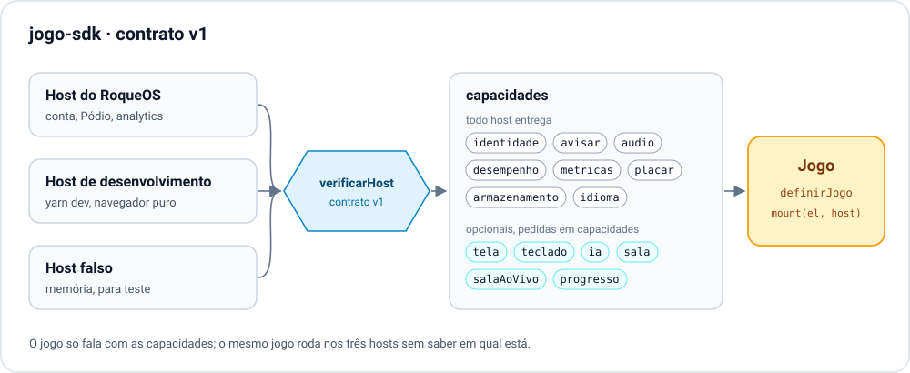
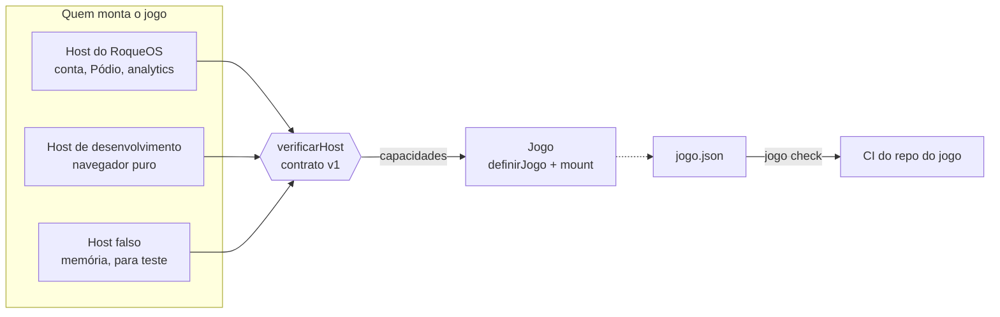

# jogo-sdk

O contrato entre o [RoqueOS](https://roqueos.com.br) e um jogo. Um jogo exporta
`mount(el, host)`; o `host` entrega capacidades (quem é o jogador, onde guardar o recorde,
se o aparelho é fraco, como avisar alguma coisa na tela) e é só por elas que o jogo fala com
o sistema. O mesmo jogo roda dentro do RoqueOS, sozinho no navegador e no teste, sem saber
em qual dos três está.



_English below._

## Por que existe

Os jogos do RoqueOS moravam dentro do repositório do sistema operacional e importavam as
stores dele direto. Em 25/09/2026 eles começaram a sair, cada um para um repo próprio na
organização [roqueos-games](https://github.com/roqueos-games), e vários vão ficar abertos
para a comunidade. Este SDK é o que torna isso possível: o jogo depende dele, e não do
RoqueOS, que é fechado.

## Arquitetura



- `definirJogo({ id, capacidades, montar })` cria o jogo. `mount` confere o host antes de
  montar e recusa, com a lista do que falta, o host que não cumpre o contrato.
- `verificarHost(host)` diz o que falta num host: capacidade ausente, forma errada, versão de
  contrato diferente. Todos os problemas de uma vez.
- `criarHostDeDesenvolvimento({ jogoId })` roda o jogo sozinho, com `localStorage` no lugar da
  conta e sem IA, de propósito.
- `criarHostFalso()` anota cada chamada em `host.chamadas` e simula mudança vinda de fora com
  `host.disparar('identidade', { uid })`.
- `jogo check` confere um repo de jogo: o `jogo.json`, os textos nos dez idiomas, a origem de
  cada asset, a ausência de script que rode sozinho no install e a ausência do Firebase no
  `src/` (o jogo não fala com banco; quem fala é o host).

As capacidades, com o motivo de cada uma, estão em [`src/contrato.js`](src/contrato.js). O
motivo é parte do contrato: capacidade sem motivo vira atalho para o jogo alcançar o que não
devia.

- Obrigatórias, que todo host entrega: `identidade`, `avisar`, `audio`, `desempenho`,
  `metricas`, `placar`, `armazenamento` e `idioma`.
- Opcionais, que o jogo pede em `capacidades` quando não vive sem elas: `tela`, `teclado`, `ia`,
  `sala`, `salaAoVivo` e `progresso`.
- `avisar(mensagem, { tipo, fixo })`: `fixo: true` fica na tela até o jogador fechar, para o
  aviso que não pode sumir sozinho ("não consegui ler o seu mundo; nada foi gravado por cima").
- `ia` é `{ completar, disponivel }` desde a 0.3.0: `disponivel()` diz antes da pergunta se há
  modelo, e `completar({ sistema, mensagens: [{ papel: 'jogador' | 'modelo', texto }] })`
  devolve texto ou `null`. O host de desenvolvimento não tem `ia`, de propósito; no teste,
  `criarHostFalso({ ia: async (pedido) => 'resposta', iaDisponivel: true })`.

### Partida online: a capacidade `sala` (desde 0.2.0)

Dois jogadores, um tabuleiro: um cria a sala e recebe um código de cinco letras e um link (o
QR), o outro entra pelo código ou pelo link, e os dois trocam o estado em tempo real. O jogo não
fala com banco nenhum; quem guarda a sala é o host, e o estado do tabuleiro é opaco para ele.
Sem conta não há sala.

```js
const { codigo, link } = await host.sala.criar({ estadoInicial, vez: 'brancas' })
const parar = host.sala.observar(codigo, (sala) => desenhar(sala)) // sala ou null
await host.sala.jogar(codigo, { estado, vez: 'pretas' })

const convite = host.sala.conviteRecebido() // aberto pelo link? o código, ou null
const r = await host.sala.entrar(convite) // { ok } ou { erro: 'nao-encontrada' | 'propria' | 'cheia' | 'sem-conta' }
```

A sala chega com `anfitriao`, `nomeDoAnfitriao`, `convidado`, `nomeDoConvidado`, `situacao`
(`esperando`, `jogando`, `encerrada`), `vez`, `estado`, `vencedor` e `anfitriaoSaiu`. O jogo que
usa sala declara `"capacidades": ["sala"]` e `"aceitaConvite": true` no `jogo.json`.

No `yarn dev` do jogo, o host de desenvolvimento joga online entre duas abas do mesmo navegador:
crie a sala numa aba e abra o link (a própria página com `?sala=<código>`) em outra aba nova. Não
duplique a aba, que copia o `sessionStorage` e vira o mesmo jogador. No teste, o host falso faz
o outro jogador com `host.disparar('sala', { acao: 'entrar', codigo, uid: 'bia' })`, e
`criarHostFalso({ convite: 'ABC23' })` abre o jogo como se viesse do link.

### Sala ao vivo: a capacidade `salaAoVivo` (desde 0.3.0)

Vários jogadores no mesmo mundo, em tempo real: presença de cada um, o que só o anfitrião
simula, a fila de intenções dos convidados, os pedaços do mundo que mudaram. É o modelo da
RagnaRoque e do RoqueCraft. O host dá o código, o link do convite e quem é o jogador, e guarda
a sala no nó que é daquele jogo; o jogo lê e escreve caminhos **dentro da sala** (`''` é a sala
inteira), com as operações do Realtime Database. O que cada nó significa é do jogo; quem decide
quem escreve onde é a regra do banco, não o SDK. Sem conta não há sala.

```js
const s = host.salaAoVivo
const { codigo, link, eu } = await s.criar({ meta: { region: 'greenwood' } }) // o host põe host, hostName e createdAt
const r = await s.entrar(s.conviteRecebido()) // { ok, meta, eu } ou { erro: 'nao-encontrada' | 'sem-conta' }

await s.gravar(codigo, `players/${eu.uid}`, { x, y, t: s.horaDoServidor() })
await s.aoCair(codigo, `players/${eu.uid}`, 'apagar') // some quando esta janela cair ou fechar
await s.atualizar(codigo, 'blocks', { '3_-7/1234': 5 }) // a chave pode ser um caminho
const chave = await s.empurrar(codigo, 'hits', { m, d, by: eu.uid })

const parar = s.observar(codigo, 'players', (jogadores) => desenhar(jogadores)) // valor ou null
s.observarFilhos(codigo, 'chat', { adicionado: (k, msg) => mostrar(msg) }, { ultimos: 60 })
s.conectado((online) => aviso(online))
s.sair(codigo) // para os ouvintes desta sala; não escreve nada
```

As garantias, que valem nos três hosts:

- Caminho com `.`, `#`, `$`, `[`, `]`, caractere de controle, `..` ou segmento vazio, e
  `undefined`, função, `NaN` ou `Date` em qualquer ponto do valor: `TypeError` na hora da
  chamada. O banco recusa os dois; pegar no teste é melhor que pegar no jogador.
- Escrita recusada (regra do banco, rede, sala que a janela não criou nem entrou) resolve
  `false`, ou `null` no `empurrar`, e nunca lança. É desse `false` que um compare-and-set
  depende.
- A primeira entrega de `observar`, `observarFilhos` e `conectado` nunca sai dentro da chamada.
- O valor volta como o banco devolve: objeto vazio some, e array é guardado por índice e volta
  array quando as chaves são inteiras e mais da metade dos índices está preenchida.

No `yarn dev`, o host de desenvolvimento joga entre abas do mesmo navegador, como a `sala`:
crie numa aba e abra o link em outra aba nova. A sala mora no `localStorage`, uma chave por
folha (`roqueos:<jogo>:salaAoVivo:<CÓDIGO>/players/aba-X/x`), para duas abas publicando
presença ao mesmo tempo nunca apagarem uma à outra; cada escrita chega inteira à outra aba,
fechar a aba roda o que ela armou com `aoCair`, e `conectado` segue o `navigator.onLine`. Ele
**não emula as regras do banco**, e o `localStorage` (cerca de 5 MB) serve para jogar e testar,
não para semear um mundo grande.

No teste, o host falso faz os outros jogadores e a regra do banco:

```js
const host = criarHostFalso({
  uid: 'ana',
  // o papel da regra do banco: true recusa (recebe { operacao, codigo, caminho, uid, valor })
  recusar: ({ caminho, uid }) => caminho === 'relogio' && uid !== 'ana',
})
host.disparar('salaAoVivo', { acao: 'criar', codigo: 'ABC23', uid: 'bia', meta: { seed: 1 } })
host.disparar('salaAoVivo', {
  acao: 'gravar',
  codigo: 'ABC23',
  uid: 'bia',
  caminho: 'players/bia',
  valor: { x: 1 },
})
host.disparar('salaAoVivo', { acao: 'aoCair', codigo: 'ABC23', uid: 'bia', caminho: 'players/bia' })
host.disparar('salaAoVivo', { acao: 'cair', uid: 'bia' }) // o que a Bia armou some
host.disparar('conexao', false) // esta janela caiu: roda o que o jogo armou com aoCair
host.arvoreDaSala('ABC23') // a sala inteira, sem passar pelo jogo
```

O jogo que usa sala ao vivo declara `"capacidades": ["salaAoVivo"]` e `"aceitaConvite": true`.
As regras de caminho e de valor também saem por `@roqueos-games/jogo-sdk/sala-ao-vivo`, para o
host do RoqueOS recusar o mesmo que os hosts de teste.

### O jogo salvo: a capacidade `progresso` (desde 0.3.0)

Um documento por jogo, na conta do jogador. "Não tem save" e "não consegui ler" são respostas
diferentes, porque confundir as duas grava um mundo vazio por cima de meses de construção.

```js
if (host.progresso.disponivel()) {
  try {
    const save = await host.progresso.carregar() // objeto, ou null se não há save
  } catch (erro) {
    // erro.codigo === 'indisponivel': não grave por cima; avise e deixe tentar de novo
    host.avisar('Não consegui ler o seu mundo; nada foi gravado por cima.', {
      tipo: 'erro',
      fixo: true,
    })
  }
}
await host.progresso.salvar({ heroi, updatedAt: Date.now() }, { mesclar: true }) // true ou false
```

`salvar` substitui o documento; com `mesclar`, funde mapa com mapa, como o `merge` do Firestore.
Os hosts de teste recusam com `false` o que o Firestore recusa: `undefined`, array dentro de
array, objeto que não é mapa simples (e `Date`, que volta do Firestore como Timestamp), campo de
nome vazio ou `__assim__`, e documento acima de 1 MiB. O host de desenvolvimento guarda em
`roqueos:<jogo>:progresso`; no falso, `criarHostFalso({ uid, progresso: { salvo, falharLeitura,
falharEscrita } })` e `host.disparar('progresso', { falharLeitura: false })`. Sem conta,
`disponivel()` é `false`.

## Pré-requisitos

- Node 24 (o `.nvmrc` diz), ou 22 no mínimo.
- Yarn 1.22.

Não há dependência de runtime. As de desenvolvimento são ESLint e Prettier.

## Como rodar

1. Clone o repo e entre na pasta.
2. Instale sem rodar script de ninguém: `yarn install --ignore-scripts`.
3. Rode tudo o que o CI roda: `yarn verificar` (lint, formato, os testes e o `jogo check` do
   próprio SDK).
4. Para conferir um repo de jogo: `node bin/jogo.mjs check ../caminho-do-jogo`.

Num repo de jogo, o SDK entra como dependência git pinada por tag:

```json
{ "dependencies": { "@roqueos-games/jogo-sdk": "github:roqueos-games/jogo-sdk#v0.3.0" } }
```

```js
import { definirJogo } from '@roqueos-games/jogo-sdk'

export default definirJogo({
  id: 'exemplo',
  montar(el, host, { ativo }) {
    const canvas = el.appendChild(document.createElement('canvas'))
    host.metricas.evento('abriu')
    return {
      ativar(sim) {},
      desmontar() {
        canvas.remove()
      },
    }
  },
})
```

## Estrutura

```
src/
  contrato.js         as capacidades, a versão e verificarHost
  index.js            definirJogo e o que o jogo importa
  manifesto.js        o formato do jogo.json e as etiquetas da galeria
  idiomas.js          os dez idiomas
  e2e.js              o modo de teste de ponta a ponta
  verificacao.js      o que o jogo check confere
  host/               desenvolvimento, falso, o espaço de chaves do armazenamento, e o que
                      os dois dividem: as regras da sala, o motor da sala ao vivo
                      (salaAoVivo.js), o progresso e o pedido da ia
bin/jogo.mjs          o CLI
test/                 node:test, com um jogo de exemplo em test/fixtures/jogo-ok
docs/contrato.svg     o diagrama acima
```

## Onde ele se encaixa na família

O RoqueOS (`roqueos-front`, fechado) implementa o host de verdade e instala cada jogo como
dependência. Os jogos, na organização [roqueos-games](https://github.com/roqueos-games),
dependem só deste SDK. Mudar a forma de uma capacidade é versão nova do contrato; capacidade
nova e opcional é versão menor. O host recusa jogo de outra versão em vez de quebrar em
runtime. A única exceção até hoje é a `ia` na 0.3.0, com o motivo e a medição no
[CHANGELOG](CHANGELOG.md).

O SDK organiza, não isola: um jogo roda na mesma origem do RoqueOS. A segurança de um jogo
aberto vem da revisão no merge e do pin exato de versão, e está descrita em
[SECURITY.md](SECURITY.md).

## Contribuir

Veja [CONTRIBUTING.md](CONTRIBUTING.md). Licença [MIT](LICENSE).

---

## English

`jogo-sdk` is the contract between [RoqueOS](https://roqueos.com.br) and a game. A game
exports `mount(el, host)`; the `host` provides capabilities (who the player is, where to keep
the high score, whether the device needs the low-end profile, how to show a notice) and that
is the only way the game talks to the system. The same game runs inside RoqueOS, standalone
in the browser, and in tests.

- `definirJogo({ id, capacidades, montar })` defines a game; `mount` checks the host first.
- `verificarHost(host)` lists every missing or malformed capability.
- `criarHostDeDesenvolvimento({ jogoId })` runs a game on its own, with `localStorage` and no AI.
- `criarHostFalso()` records every call for tests.
- `jogo check` validates a game repo: `jogo.json`, texts in the ten languages, asset
  provenance, no install-time scripts, and no Firebase import under `src/` (the game never
  talks to a database; the host does).
- Optional capabilities: `tela` (fullscreen), `teclado` (keyboard focus), `ia` (AI completion:
  `disponivel()` says up front whether a model is available, `completar({ sistema, mensagens:
[{ papel, texto }] })` returns text or `null`) and, since 0.2.0, `sala`: a two-player online
  match. One player creates a room and gets a five-letter code and an invite link, the other
  joins, and both exchange the board state. The game never talks to a database, the state is
  opaque to the host, and there is no room without an account. The dev host plays it across two
  tabs of the same browser (`localStorage` plus the `storage` event, no network), and the fake
  host simulates the other player with `host.disparar('sala', { acao, codigo })`.
- Since 0.3.0, `salaAoVivo`: a real-time room for many players (presence, host-only nodes,
  guest intents, chat). The host provides the code, the invite link and the player; the game
  reads and writes paths inside the room with Realtime Database operations (`ler`, `gravar`,
  `atualizar`, `apagar`, `empurrar`, `observar`, `observarFilhos`, `aoCair`). Bad paths and
  `undefined` throw `TypeError` at call time, refused writes resolve `false`, first deliveries
  are always asynchronous, and values come back the way the database returns them. The dev
  host plays it across tabs with one `localStorage` key per leaf; the fake host adds other
  players, a connection drop and a `recusar` option that stands in for the database rules.
- Since 0.3.0, `progresso`: the player's saved game on their account. `carregar()` returns
  `null` when there is no save and rejects with `codigo: 'indisponivel'` when it cannot read;
  `salvar(dados, { mesclar })` never throws. The test hosts refuse what Firestore refuses
  (`undefined`, nested arrays, non-plain objects, documents over 1 MiB).
- `avisar(mensagem, { tipo, fixo })`: `fixo: true` stays on screen until the player closes it.

Requirements: Node 24 (22 minimum) and Yarn 1.22. Run `yarn install --ignore-scripts`, then
`yarn verificar`. The code and comments are in Brazilian Portuguese, which is the canonical
language of the project; issues and pull requests in English are welcome. MIT licensed.
