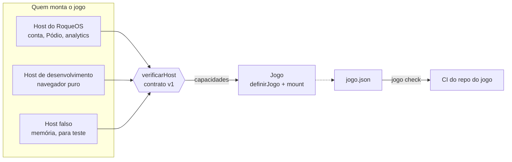

# jogo-sdk

O contrato entre o [RoqueOS](https://roqueos.com.br) e um jogo. Um jogo exporta
`mount(el, host)`; o `host` entrega capacidades (quem é o jogador, onde guardar o recorde,
se o aparelho é fraco, como avisar alguma coisa na tela) e é só por elas que o jogo fala com
o sistema. O mesmo jogo roda dentro do RoqueOS, sozinho no navegador e no teste, sem saber
em qual dos três está.


_English below._

## Por que existe

Os jogos do RoqueOS moravam dentro do repositório do sistema operacional e importavam as
stores dele direto. Em 25/09/2026 eles começaram a sair, cada um para um repo próprio na
organização [roqueos-games](https://github.com/roqueos-games), e vários vão ficar abertos
para a comunidade. Este SDK é o que torna isso possível: o jogo depende dele, e não do
RoqueOS, que é fechado.

## Arquitetura



- `definirJogo({ id, capacidades, montar })` cria o jogo. `mount` confere o host antes de
  montar e recusa, com a lista do que falta, o host que não cumpre o contrato.
- `verificarHost(host)` diz o que falta num host: capacidade ausente, forma errada, versão de
  contrato diferente. Todos os problemas de uma vez.
- `criarHostDeDesenvolvimento({ jogoId })` roda o jogo sozinho, com `localStorage` no lugar da
  conta e sem IA, de propósito.
- `criarHostFalso()` anota cada chamada em `host.chamadas` e simula mudança vinda de fora com
  `host.disparar('identidade', { uid })`.
- `jogo check` confere um repo de jogo: o `jogo.json`, os textos nos dez idiomas, a origem de
  cada asset e a ausência de script que rode sozinho no install.

As capacidades, com o motivo de cada uma, estão em [`src/contrato.js`](src/contrato.js). O
motivo é parte do contrato: capacidade sem motivo vira atalho para o jogo alcançar o que não
devia.

## Pré-requisitos

- Node 24 (o `.nvmrc` diz), ou 22 no mínimo.
- Yarn 1.22.

Não há dependência de runtime. As de desenvolvimento são ESLint e Prettier.

## Como rodar

1. Clone o repo e entre na pasta.
2. Instale sem rodar script de ninguém: `yarn install --ignore-scripts`.
3. Rode tudo o que o CI roda: `yarn verificar` (lint, formato, os testes e o `jogo check` do
   próprio SDK).
4. Para conferir um repo de jogo: `node bin/jogo.mjs check ../caminho-do-jogo`.

Num repo de jogo, o SDK entra como dependência git pinada por tag:

```json
{ "dependencies": { "@roqueos-games/jogo-sdk": "github:roqueos-games/jogo-sdk#v0.1.0" } }
```

```js
import { definirJogo } from '@roqueos-games/jogo-sdk'

export default definirJogo({
  id: 'exemplo',
  montar(el, host, { ativo }) {
    const canvas = el.appendChild(document.createElement('canvas'))
    host.metricas.evento('abriu')
    return {
      ativar(sim) {},
      desmontar() {
        canvas.remove()
      },
    }
  },
})
```

## Estrutura

```
src/
  contrato.js         as capacidades, a versão e verificarHost
  index.js            definirJogo e o que o jogo importa
  manifesto.js        o formato do jogo.json e as etiquetas da galeria
  idiomas.js          os dez idiomas
  e2e.js              o modo de teste de ponta a ponta
  verificacao.js      o que o jogo check confere
  host/               desenvolvimento, falso e o espaço de chaves do armazenamento
bin/jogo.mjs          o CLI
test/                 node:test, com um jogo de exemplo em test/fixtures/jogo-ok
docs/contrato.svg     o diagrama acima
```

## Onde ele se encaixa na família

O RoqueOS (`roqueos-front`, fechado) implementa o host de verdade e instala cada jogo como
dependência. Os jogos, na organização [roqueos-games](https://github.com/roqueos-games),
dependem só deste SDK. Mudar a forma de uma capacidade é versão nova do contrato; capacidade
nova e opcional é versão menor. O host recusa jogo de outra versão em vez de quebrar em
runtime.

O SDK organiza, não isola: um jogo roda na mesma origem do RoqueOS. A segurança de um jogo
aberto vem da revisão no merge e do pin exato de versão, e está descrita em
[SECURITY.md](SECURITY.md).

## Contribuir

Veja [CONTRIBUTING.md](CONTRIBUTING.md). Licença [MIT](LICENSE).

---

## English

`jogo-sdk` is the contract between [RoqueOS](https://roqueos.com.br) and a game. A game
exports `mount(el, host)`; the `host` provides capabilities (who the player is, where to keep
the high score, whether the device needs the low-end profile, how to show a notice) and that
is the only way the game talks to the system. The same game runs inside RoqueOS, standalone
in the browser, and in tests.

- `definirJogo({ id, capacidades, montar })` defines a game; `mount` checks the host first.
- `verificarHost(host)` lists every missing or malformed capability.
- `criarHostDeDesenvolvimento({ jogoId })` runs a game on its own, with `localStorage` and no AI.
- `criarHostFalso()` records every call for tests.
- `jogo check` validates a game repo: `jogo.json`, texts in the ten languages, asset
  provenance, and no install-time scripts.

Requirements: Node 24 (22 minimum) and Yarn 1.22. Run `yarn install --ignore-scripts`, then
`yarn verificar`. The code and comments are in Brazilian Portuguese, which is the canonical
language of the project; issues and pull requests in English are welcome. MIT licensed.
